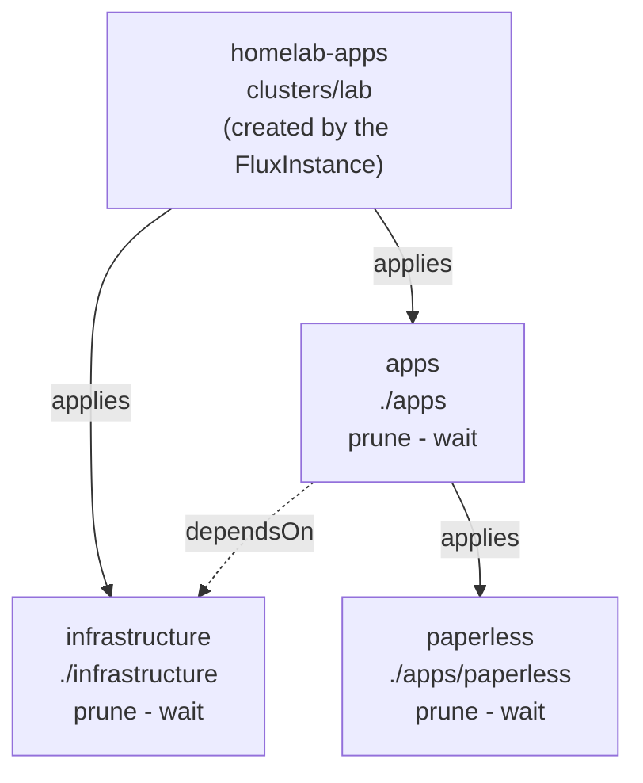

# homelab-apps

What runs on the cluster, reconciled by Flux. The layer below
[platform](https://github.com/Sojamann/homelab) which installs Flux and
then stops.

## Layout

```
clusters/lab/              the entrypoint -- FluxInstance.spec.sync.path points here
infrastructure/            shared services -- operators the apps depend on
apps/                      a Flux Kustomization per app, plus its directory
```

diagram:

> post-build applies `cluster-vars` secret providing the domain

## Infrastructure
Shared services the apps depend on being installed, operators and the like.
Applied directly by the `infrastructure` Kustomization, no per-item split, so
nothing here may name a CRD another chart in this tier installs. A CR belongs
beside the app that owns it, one tier down.

| Name           | Description       | Namespace     | Version                     |
|----------------|-------------------|---------------|---------------------------- |
| cloudnative-pg | postgres operator | `cnpg-system` | chart 0.29.0 (operator 1.30)|

## Apps
Every app is its own flux `Kustomization` so it is reconsiled seperately and
is deployed in it's own namespace which may hold the app itself together
with secrets and storage definitions.

| Name          | Description       | Domain                | Docs                          |
|---------------|-------------------|-----------------------|------------------------------ |
| paperless-ngx | pdf management    | `paperless.${app_domain}` | [link](./docs/paperless.md)   |


- **`enableServiceLinks: false`, always.** The kubelet injects a Docker-link
  variable per Service in the namespace -- `{SERVICE_NAME}_PORT=tcp://ip:port`
  and friends. Which might lead to unwanted configurations.
