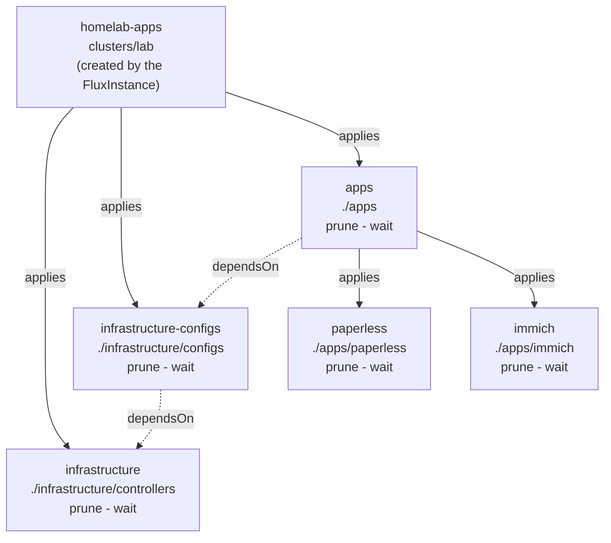

# homelab-apps

What runs on the cluster, reconciled by Flux. The layer below
[platform](https://github.com/Sojamann/homelab) which installs Flux and
then stops.

## Layout

```
clusters/lab/              the entrypoint -- FluxInstance.spec.sync.path points here
infrastructure/controllers shared services -- operators and charts the apps depend on
infrastructure/configs     CRs no app owns, naming kinds the controllers install
apps/                      a Flux Kustomization per app, plus its directory
```

diagram:

> post-build applies `cluster-vars` secret providing the domain

## Infrastructure
Shared services the apps depend on being installed, operators and the like.
Two Kustomizations, because a CR cannot be applied in the same pass as the
chart that defines its kind:

- `infrastructure` -> `controllers/`: the charts. Nothing here may name a CRD
  another chart in this tier installs. The name predates the split and must
  not change -- renaming prunes the CNPG release, its CRDs, and every database.
- `infrastructure-configs` -> `configs/`: CRs no app owns (scrape targets
  outside the cluster, rules, dashboards). A CR an app owns belongs beside that
  app instead.

| Name                  | Description        | Namespace     | Version                        | Docs                         |
|-----------------------|--------------------|---------------|--------------------------------|------------------------------|
| cloudnative-pg        | postgres operator  | `cnpg-system` | chart 0.29.0 (operator 1.30)   |                              |
| kube-prometheus-stack | metrics + grafana  | `monitoring`  | chart 91.3.0 (operator 0.94.0) | [link](./docs/monitoring.md) |

Grafana is served at `grafana.${app_domain}`.

## Apps
Every app is its own flux `Kustomization` so it is reconsiled seperately and
is deployed in it's own namespace which may hold the app itself together
with secrets and storage definitions.

| Name          | Description       | Domain                | Docs                          |
|---------------|-------------------|-----------------------|------------------------------ |
| paperless-ngx | pdf management    | `paperless.${app_domain}` | [link](./docs/paperless.md)   |
| immich        | photo library     | `photos.${app_domain}`    | [link](./docs/immich.md)      |


- **`enableServiceLinks: false`, always.** The kubelet injects a Docker-link
  variable per Service in the namespace -- `{SERVICE_NAME}_PORT=tcp://ip:port`
  and friends. Which might lead to unwanted configurations.
