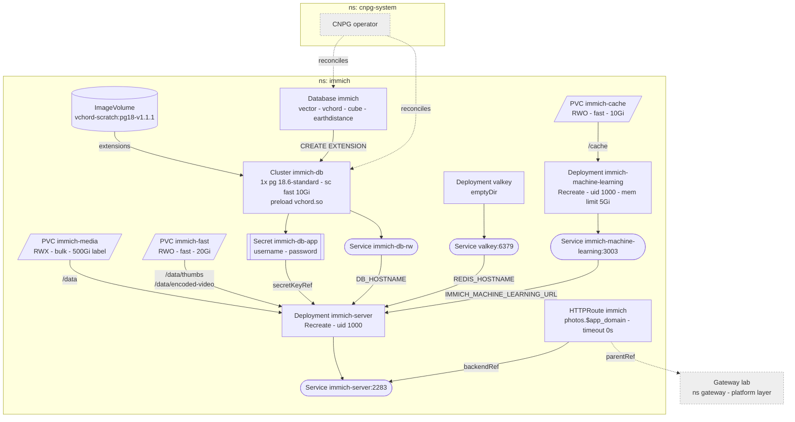

# Immich

Photo and video library -- phone backup, timeline, face and smart search.
LAN and NetBird only, like everything behind the gateway.

## Storage

| PVC            | Class  | Holds                                   | Lost means                         |
|----------------|--------|-----------------------------------------|------------------------------------|
| `immich-media` | `bulk` | `library/` `upload/` `profile/` `backups/` | photos gone -- restore NAS snapshot |
| `immich-fast`  | `fast` | `thumbs/` `encoded-video/`              | re-run "Missing" thumbnail/transcode jobs |
| `immich-cache` | `fast` | ML models                               | re-download on next start          |
| CNPG `immich-db` | `fast` | albums, faces, EXIF, sharing          | **library structure gone** -- no backup |

`fast` zvols are thick: each PVC reserves its full size on the NVMe. Grow by
editing the request; never shrink.

Never mount `upload/` and `library/` separately -- Immich moves between them
by rename.

## Known gaps

- **No database backup.** Same as paperless. `fast` is one unmirrored NVMe with
  no snapshot task. Immich's own backup job needs superuser (`pg_dumpall`),
  which CNPG does not hand out, so it stays off.
- **Bootstrap reports failed once.** `immich-server` crash-loops until the
  `Database` has created the extensions; the Kustomization's retry clears it.

## First run

1. Open `https://photos.<app_domain>`, create the admin account -- the first
   user is admin, nothing is seeded.
2. *Administration -> Settings -> Machine Learning -> Smart Search*: set the
   CLIP model to `ViT-B-16-SigLIP-i18n-256__webli` (German and English
   queries, ~3 GB resident). Changing it later re-encodes the whole library.
3. *Administration -> Settings -> Backup*: leave database dumps disabled (see
   above).
4. Phones: join NetBird, then point the app at `https://photos.<app_domain>`.

## Upgrading

- `immich-server` and `immich-machine-learning` move together, same tag.
- Check the release notes' vchord range against `database.yaml` before a
  bump; bumping the `vchord-scratch` tag makes CNPG run `ALTER EXTENSION`.
