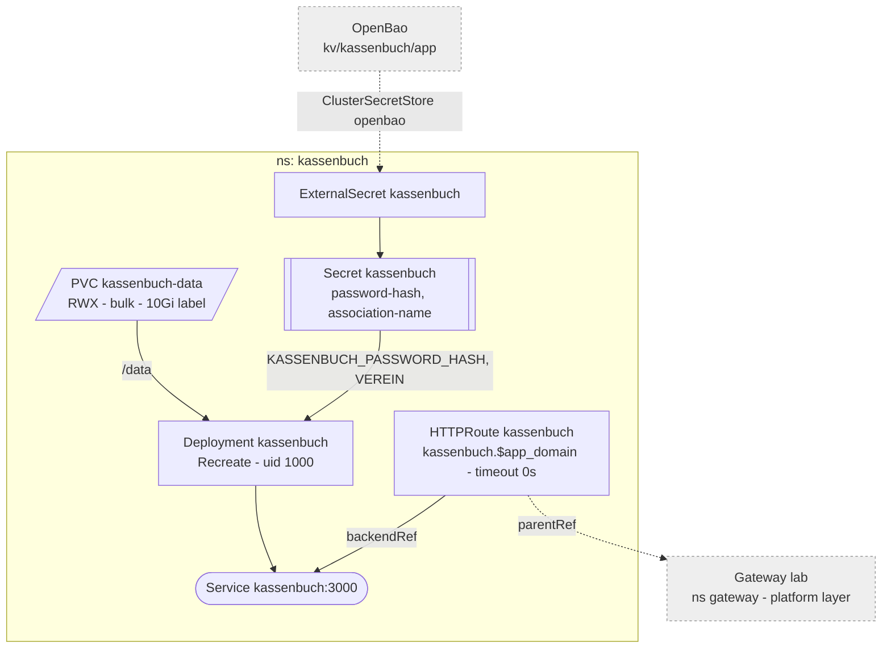

# Kassenbuch

Single-user Kassenbuch for the Verein. Built in the private
[kassenbuch](https://github.com/Sojamann/kassenbuch) repo; the image
`ghcr.io/sojamann/kassenbuch` is public, so there is no pull secret.
LAN and NetBird only, like everything behind the gateway.



## Storage

One `bulk` PVC for all of `/data`: `kassenbuch.db` (SQLite, WAL), `belege/`,
`exports/`. These are records with a retention duty, so they sit on the
mirror and in the NAS snapshot task (hourly 24h, daily 30d) rather than on the
unmirrored `fast` NVMe. One pod on one node over NFSv4.1 keeps SQLite's
locking sound; never scale past one replica.

Restore: scale to 0, copy the directory back out of the NAS snapshot
(`.zfs/snapshot/<name>/` of the PV's directory under `k8s-csi`), scale to 1.

## Password

Besides `ORIGIN`, the app reads `KASSENBUCH_PASSWORD_HASH` and `VEREIN`, the
Verein's name -- kept in the vault as `kassenbuch_association_name` and synced
the same way, so it stays out of this public repo. The plaintext lives in a
password manager; the hash in `secrets/vault.yml` as
`kassenbuch_password_hash`, from where `platform_secrets.tf` writes it to
OpenBao at `kv/kassenbuch/app`.

Set or rotate:

```sh
docker run --rm -it ghcr.io/sojamann/kassenbuch:<tag> node scripts/hash-password.js
ansible-vault edit secrets/vault.yml      # kassenbuch_password_hash: <the quoted value>
mise run platform apply
kubectl -n kassenbuch annotate externalsecret kassenbuch force-sync=$(date +%s) --overwrite
kubectl -n kassenbuch rollout restart deploy/kassenbuch   # env is read at start
```

## Updates

The tag is pinned. A release is a `v*` tag in the app repo (CI pushes
`<version>`) followed by a bump of `image:` in `apps/kassenbuch/server.yaml`.
Migrations run on start.
