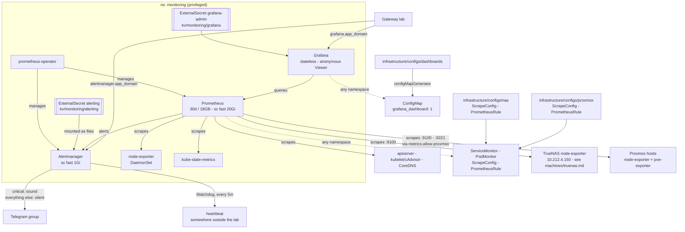

# Monitoring

kube-prometheus-stack: Prometheus, Alertmanager and Grafana, plus the exporters
for the cluster itself.

Grafana is `grafana.${app_domain}`: anonymous visitors are Viewers, the admin
is in OpenBao (`bao kv get kv/monitoring/grafana`). Alertmanager is
`alertmanager.${app_domain}` with no auth at all -- every LAN and NetBird peer
can silence an alert, which is the price of being able to silence one from a
phone. Prometheus has neither auth nor route:

> **Storage Note** data is dropped after 30 days or when it reaches 18GB.

## Dashboards

The chart's own are off. Ours live flat in `infrastructure/configs/dashboards/`,
no folders:

| Dashboard    | For                                                                 |
|--------------|---------------------------------------------------------------------|
| Lab (home)   | traffic lights only -- NAS pools + host, Proxmox hosts + storage, k8s nodes: status, CPU, memory, disk, network errors/drops; each links to its detail dashboard |
| K8s Overview | the quick look -- CPU, memory (usage + requests), network, disk per node; what each PVC holds |
| K8s Detail   | digging in -- stats, per namespace, per pod CPU/throttling/memory, a pods table |
| NAS          | pool fill + state, CPU, memory with ARC split out, ARC hit ratio, network |
| Proxmox      | quorum, storage fill, CPU, memory (usage + assigned), root fs, network per host; a guests table |

Anything else is in Prometheus and reachable through Explore.

**Changing one:** edit in the UI, Share -> Export -> paste over the JSON file,
commit. Grafana is stateless, so an unexported edit is gone on the next restart.
A new dashboard is a new file plus a `configMapGenerator` entry.

## Alerting

Everything lands in one Telegram group. `severity: critical` arrives with a
sound and repeats every 4h; everything else arrives silently and repeats every
12h -- a notification per warning is how you learn to swipe warnings away. Too
noisy is fixed in the rule, not in the routing.

`Watchdog` is the exception. It fires permanently by design, so it is routed to
a heartbeat URL instead of the chat: when the pings stop, because Prometheus or
the cluster or the WAN is what broke, whoever hosts that URL is what notices --
from outside the lab, which nothing in this diagram can do. Any service that
complains when a ping stops will do, and which one is in use is a fact about
`secrets/vault.yml`, not about this repo.

Two values have to exist in `secrets/vault.yml` before any of it works: a
Telegram bot token with the id of the group it posts into, and that heartbeat
URL. Both are written into OpenBao by the platform layer; the bot
token and the URL are mounted as files, the chat id travels in `cluster-vars`
because it is no credential but names a private group.

Grafana's own alerting is unused. One alerting engine, and it is Prometheus:
Grafana is stateless here, so a rule made in its UI is gone on the next restart.
