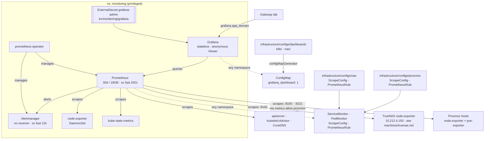

# Monitoring

kube-prometheus-stack: Prometheus, Alertmanager and Grafana, plus the exporters
for the cluster itself.

Grafana is `grafana.${app_domain}`: anonymous visitors are Viewers, the admin
is in OpenBao (`bao kv get kv/monitoring/grafana`). Prometheus and Alertmanager
have no auth and no route:

> **Storage Note** data is dropped after 30 days or when it reaches 18GB.

## Dashboards

The chart's own are off. Ours live in `infrastructure/configs/dashboards/`, one
directory per Grafana folder:

| Folder | Dashboard    | For                                                                 |
|--------|--------------|---------------------------------------------------------------------|
| K8s    | K8s Overview | the quick look -- CPU, memory (usage + requests), network, disk per node; what each PVC holds |
| K8s    | K8s Detail   | digging in -- stats, per namespace, per pod CPU/throttling/memory, a pods table |
| NAS    | NAS          | pool fill + state, CPU, memory with ARC split out, ARC hit ratio, network |

Anything else is in Prometheus and reachable through Explore.

**Changing one:** edit in the UI, Share -> Export -> paste over the JSON file,
commit. Grafana is stateless, so an unexported edit is gone on the next restart.
A new dashboard is a new file plus a `configMapGenerator` entry; a new folder
is a new directory.
