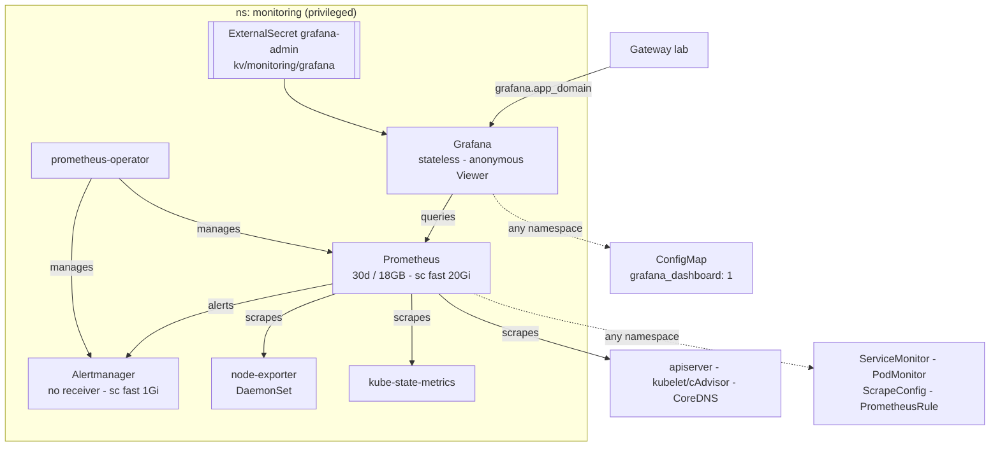

# Monitoring

kube-prometheus-stack: Prometheus, Alertmanager and Grafana, plus the exporters
for the cluster itself.

Grafana is `grafana.${app_domain}`: anonymous visitors are Viewers, the admin
is in OpenBao (`bao kv get kv/monitoring/grafana`). Prometheus and Alertmanager
have no auth and no route:

> **Storage Note** data is dropped after 30 days or when it reaches 18GB.
