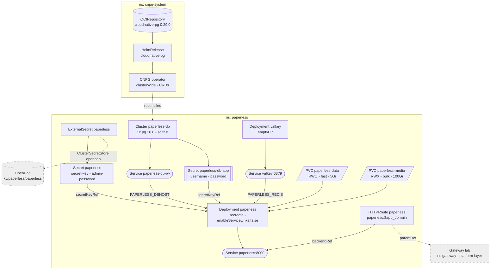

# Paperless

Deploying the PDF management/search tool *paperless-ngx*

```mermaid
graph TD
  subgraph cnpg["ns: cnpg-system"]
    OCI[("OCIRepository<br/>cloudnative-pg 0.29.0")] --> HR["HelmRelease<br/>cloudnative-pg"]
    HR --> OP["CNPG operator<br/>clusterWide - CRDs"]
  end

  subgraph pn["ns: paperless"]
    ES["ExternalSecret paperless"] --> SEC[["Secret paperless<br/>secret-key - admin-password"]]

    PGC["Cluster paperless-db<br/>1x pg 18.6 - sc fast"] --> PGSVC(["Service paperless-db-rw"])
    PGC --> PGSEC[["Secret paperless-db-app<br/>username - password"]]

    VKD["Deployment valkey<br/>emptyDir"] --> VKSVC(["Service valkey:6379"])

    DEP["Deployment paperless<br/>Recreate - enableServiceLinks:false"]
    DEP --> SVC(["Service paperless:8000"])

    PVC1[/"PVC paperless-data<br/>RWO - fast - 5Gi"/] --> DEP
    PVC2[/"PVC paperless-media<br/>RWX - bulk - 100Gi"/] --> DEP

    SEC -->|secretKeyRef| DEP
    PGSEC -->|secretKeyRef| DEP
    PGSVC -->|PAPERLESS_DBHOST| DEP
    VKSVC -->|PAPERLESS_REDIS| DEP

    RT["HTTPRoute paperless<br/>paperless.$app_domain"] -->|backendRef| SVC
  end

  OP -.->|reconciles| PGC
  RT -.->|parentRef| GW["Gateway lab<br/>ns gateway - platform layer"]
  ES -.->|"ClusterSecretStore openbao"| BAO[("OpenBao<br/>kv/paperless/paperless")]

  classDef ext fill:#eee,stroke:#999,stroke-dasharray:3 3;
  class GW,BAO ext;
```
