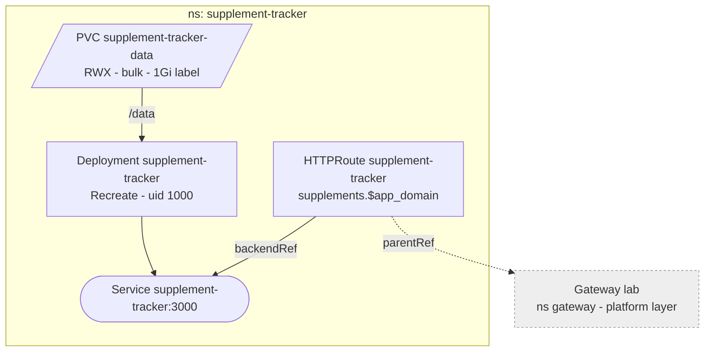

# Supplement tracker

The household's supplement plan, daily ticks and nutrient overview. Built in
the private repo `supplement-tracker` and pushed by hand to
`registry.${app_domain}/supplement-tracker` ([zot](./zot.md)), which allows
anonymous pulls, so there is no pull secret. No login: LAN and tailnet only,
like everything behind the gateway.

## Storage

One `bulk` PVC for `/data`, which holds only `supplements.db` (SQLite, WAL).
The app has no export, so the NAS snapshot task (hourly 24h, daily 30d) is
the backup. One pod on one node over NFSv4.1 keeps SQLite's locking sound;
never scale past one replica.

Restore: scale to 0, copy the directory back out of the NAS snapshot
(`.zfs/snapshot/<name>/` of the PV's directory under `k8s-csi`), scale to 1.

## Config

Only `ORIGIN`, the public URL that form actions are CSRF-checked against. No
secrets, so no ExternalSecret. Probes hit `/healthz`, which runs a query.

## Updates

The tag is pinned. A release is a `v*` tag in the app repo, `mise run release`
there, then `mise run image supplement-tracker <version>` here, which pushes it
to zot and bumps `image:` in `apps/supplement-tracker/server.yaml`. Migrations
run on start.
