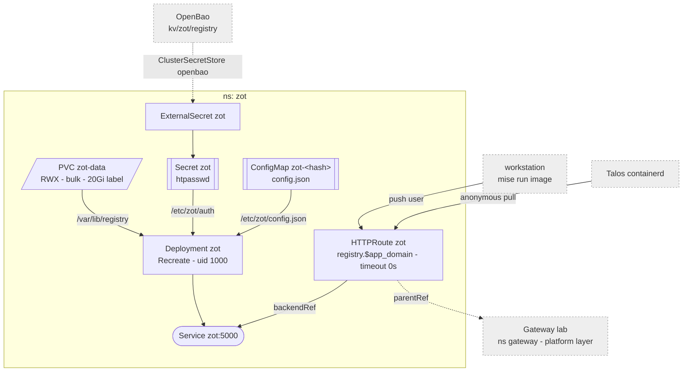

# Zot

In-cluster OCI registry for own images, so they need not go to ghcr. Own
images only -- no pull-through cache, so the nodes need no mirror config and a
zot outage only stops own apps from (re)pulling. LAN and tailnet only, like
everything behind the gateway. UI at `registry.${app_domain}`.



## Access

| Who | How | Can |
|--|--|--|
| anyone on the LAN | anonymous | pull, browse the UI |
| `push` | htpasswd | push, delete |

Anonymous read means no `imagePullSecret` in any namespace. Nodes pull through
the gateway like any client: the wildcard cert is Let's Encrypt, so containerd
trusts it with no Talos config.

The password is generated in `platform_secrets.tf` and lives only in OpenBao,
at `kv/zot/registry`. Read it out with the root token once per workstation:

```sh
crane auth login registry.<app_domain> -u push --password-stdin
```

`compat: docker2s2` is on so a plain `docker push` (Docker-format manifests)
is accepted, not only OCI ones.

## Releasing

Builds happen in the app's repo, pushes happen here -- the app repos know
nothing about this registry and hold no credential for it.

```sh
# in the app repo: clean tree, tagged HEAD, tests, linux/amd64 into local docker
mise run release                       # -> kassenbuch:1.0.1

# in lab
mise run image kassenbuch 1.0.1        # push to zot, bump flux/apps/kassenbuch
git add <...> && mise run save "kassenbuch: 1.0.1"
```

`image` refuses a non-semver tag (retention would delete it), an image that
is not `linux/amd64`, and a tag zot already has: a node that pulled it keeps
its copy, so overwriting would run different code depending on where the pod
lands. It only rewrites `image: registry.${app_domain}/<app>:` lines, so an app
moves onto zot by hand once and is bumped by the task from then on.

It pushes with crane and the workstation's own `crane auth login` as `push`.

## Tags and retention

Repositories are flat: `registry.${app_domain}/<app>:<tag>`.

| Tag | For | Kept |
|--|--|--|
| `1.2.3` / `v1.2.3` | releases, what manifests reference | the 5 most recently pushed |
| `sha-*`, `dev-*` | throwaway builds | pushed within 14 days |
| anything else (`latest` included) | -- | **deleted** |

Untagged manifests and orphaned referrers go after 24h; GC runs daily.

Zot cannot see what is deployed, so "unused" is judged by push recency, not
pulls: containerd caches an image and never pulls it again, so a
`pulledWithin` rule would delete the image a running app needs on its next
node rebuild. Rolling back further than 5 releases means re-pushing.

Retention runs live, no dry run: everything in here is rebuildable from source.

## Storage

`bulk`, because an empty registry means re-pushing every own image before its
app can restart. Dedupe hardlinks blobs, which NFS supports. One replica only:
two instances GC-ing one directory would race.
